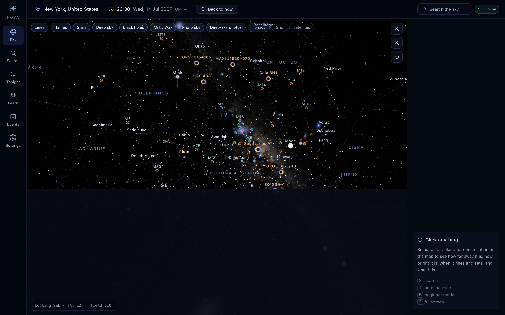

# NovaSky

A desktop stargazing app for Windows, macOS and Linux. NovaSky draws the real sky above
your location at any moment in time, tells you what you are looking at, and works
without a network connection.



## What it does

- **Interactive 3D sky map** — 8 920 naked-eye stars, 74 559 telescopic stars whose
  density *is* the Milky Way, all 88 constellation figures, the Sun, Moon and planets,
  1 314 deep-sky objects drawn at their real angular size and shape, 17 black holes, and
  live satellites. Mouse, trackpad and keyboard navigation, with a horizon and compass.
- **Real photography, correctly registered** — a photographic all-sky panorama sits
  behind the computed sky, aligned by converting each view direction into galactic
  coordinates. Zoom in on a nebula or galaxy and NovaSky loads an actual survey image of
  it, placed at its true position, scale and orientation, with the catalogue stars
  landing on the stars in the photograph.
- **Object search and details** — find anything by name, Bayer letter or catalogue
  number and get its altitude, azimuth, magnitude, distance, rise/transit/set times,
  visibility, best viewing time, a plain-language explanation, and links to NASA,
  Wikipedia and SIMBAD.
- **Time Machine** — set the sky to any past or future date, or play time forward at up
  to a month per second.
- **Visible Tonight** — what is actually worth going outside for, from your location,
  checked against tonight's dark window.
- **Events** — eclipses, meteor showers, conjunctions, oppositions, elongations, lunar
  phases, solstices and equinoxes, each annotated with whether it is visible from where
  you are.
- **Beginner mode and Learn** — a reduced sky, guided activities that complete when you
  actually find the object, quizzes, and achievements stored locally.
- **Offline first** — every catalogue ships with the app. Only satellite tracking needs
  the network, and the UI always says whether data is calculated, from a catalogue,
  live, or cached.

## Requirements

- Node.js 20 or newer
- npm 10 or newer
- A working C toolchain for the one native dependency (`better-sqlite3`). On macOS that
  means Xcode Command Line Tools; on Windows, the Visual Studio Build Tools; on Linux,
  `build-essential` and `python3`. If it cannot be built, NovaSky falls back to a JSON
  file store and says so in Settings — nothing else changes.

## Setup

```bash
npm install
```

```bash
npm run data:build
```

`data:build` downloads the source catalogues once (about 38 MB) and reduces them to the
~3 MB of JSON that ships inside the app, in `resources/data`. Downloads are cached in
`.data-cache/`, so re-running it is cheap. **The app will not start without this step** —
it reports the missing files and tells you to run it.

## Running

There is one application, and two ways to start it. You never launch Electron
separately — Electron is the runtime NovaSky is built on, the way a Java app runs on the
JVM.

**For development**, with hot reload:

```bash
npm run dev
```

macOS shows this in the Dock as **Electron**, not NovaSky, because it runs inside the
generic development binary. That is expected, and it is the same app.

**For actually using it**, build the packaged app once and open it like any other:

```bash
npm run pack:mac
```

```bash
open release/mac-arm64/NovaSky.app
```

That one is named NovaSky, carries the NovaSky icon, and needs no terminal.

```bash
npm run build
```

Type-checks both projects and produces a production bundle in `out/`.

```bash
npm start
```

Runs the production bundle without packaging it.

```bash
npm run icon
```

Regenerates `build/icon.png`, the single source image electron-builder turns into the
macOS, Windows and Linux icon sets.

## Packaging

```bash
npm run pack:mac
```

```bash
npm run pack:win
```

```bash
npm run pack:linux
```

Output lands in `release/`. The unpacked `.app` lands in `release/mac-arm64/` (or `release/mac/` on Intel). macOS
also produces a `.dmg` and a `.zip`, Windows an NSIS
installer and a portable `.exe`, Linux an AppImage and a `.deb`. Cross-compiling to
Windows or Linux from macOS works for the JavaScript, but `better-sqlite3` is native —
build each platform's installer on that platform, or in CI, so the binding matches.

## Testing

```bash
npm test
```

141 tests covering the astronomy (coordinate transforms checked against
astronomy-engine's own routines, rise/set/transit against known geometry, eclipse and
meteor-shower dates against published values, SGP4 against real ISS elements) and the UI
(search, Time Machine, onboarding, the details panel, accessibility roles).

```bash
npm run typecheck
```

## Keyboard shortcuts

| Key | Action |
| --- | --- |
| `T` | Open the Time Machine |
| `S` | Focus search |
| `B` | Toggle beginner mode |
| `F` | Toggle fullscreen |
| `Esc` | Close panels |
| Arrow keys | Look around the sky |
| `+` / `-` | Zoom in and out |
| `0` | Reset the view |

## Project layout

```
novasky/
├── scripts/build-data.mjs   # downloads and reduces the source catalogues
├── resources/data/          # the offline catalogues that ship with the app
├── src/
│   ├── main/                # Electron main: window, storage, network, notifications
│   ├── preload/             # the single, audited bridge into the renderer
│   ├── renderer/            # React UI and the Three.js sky map
│   └── shared/              # astronomy, catalogue model and types, used by both
├── tests/                   # astronomy and UI tests
└── docs/                    # data sources, design, and how to extend the app
```

`src/shared` has no Electron and no DOM dependencies, so every astronomical calculation
is testable in isolation and reusable from either process.

## Privacy

NovaSky has no accounts, no telemetry and no analytics. Your location, settings and
learning progress live in a SQLite database inside the app's own data directory on this
machine. The only outbound request the app ever makes is to CelesTrak for satellite
orbital elements, which can be turned off entirely in Settings. Settings also has
one-click controls for clearing cached downloads or erasing all local data.

## Documentation

- [Data sources and accuracy](docs/DATA_SOURCES.md)
- [Design and screens](docs/DESIGN.md)
- [Extending NovaSky](docs/EXTENDING.md)
- [Architecture](docs/ARCHITECTURE.md)

## Licence

MIT. The bundled catalogues keep their own licences — see
[docs/DATA_SOURCES.md](docs/DATA_SOURCES.md).
