# Design

NovaSky is a dark, quiet interface built to be used at night, next to a telescope, by
someone whose eyes are dark-adapted. Every decision below follows from that.

The screens below are captures of the running application, not mockups. They are
regenerated from the real app with `npm run capture`, which drives it through every
screen and asserts nothing threw along the way, so they cannot quietly drift out of date.

## Principles

1. **The sky is the interface.** Chrome is thin, translucent and pushed to the edges.
   The map is always full-bleed.
2. **Say where every number came from.** Nothing is presented without provenance. An
   observer deciding whether to set up a telescope needs to know whether a rise time was
   computed for their coordinates or copied from somewhere.
3. **Absence is information.** "Not catalogued" is shown proudly. Inventing a plausible
   distance would be worse than admitting there isn't one.
4. **Explain, do not just display.** Every measurement has a tooltip explaining what it
   means. Magnitude runs backwards; azimuth starts at north; a beginner does not know
   this and should not have to leave the app to find out.
5. **Nothing surprising happens.** Notifications, network access and location are all
   opt-in, and every one of them can be revoked in Settings.

## Colour

A deep navy-black ground rather than pure black, so that panels can sit on it with a
visible edge without glowing.

| Token | Hex | Use |
| --- | --- | --- |
| `space-950` | `#04060f` | app background and the sky map's clear colour |
| `space-900` | `#080c1a` | screen backgrounds |
| `space-850` | `#0d1324` | panels |
| `space-800` / `700` / `600` | `#131a30` / `#1d2745` / `#2a375c` | raised surfaces, borders, controls |
| `nova-500` | `#4d86ff` | primary actions and the current selection |
| `nova-300` | `#a5c8ff` | links and secondary emphasis |

Body text is `slate-100` on `space-900` (about 15:1), secondary text `slate-400` (about
6:1), and the faintest supporting text `slate-500` (about 4.6:1). All exceed WCAG AA;
body text exceeds AAA.

Status colours are used consistently and never alone — every coloured badge also carries
a word:

- emerald: visible now, achievement unlocked
- amber: caution — twilight, stale data, location not set
- sky blue: informational — calculated values
- rose: destructive — erasing local data

## Typography

A single system sans stack (Inter where present), with a monospace stack for coordinates
and magnitudes so that columns of numbers line up and digits do not shift as the sky
time ticks. Section headings are small, letter-spaced and uppercase; object names are
the only large type in the app.

## Layout

A fixed 76-pixel navigation rail on the left, a slim status bar across the top, and the
screen below. On the Sky screen a 360-pixel details panel slides in from the right when
something is selected; on wide displays a hint card occupies that space when nothing is.
Layouts are fluid from 1024 pixels (the enforced minimum window width) upward, with
Tonight, Events and Settings collapsing from two or four columns to one.

## The screens

### Onboarding

Six steps: what NovaSky is, why it wants a location, how to move around the map, the
Time Machine, notifications, and beginner mode. Skippable from any step, and replayable
from Settings or the Learn screen. Location entry and the notification permission are
embedded in the flow rather than deferred to a separate dialog.

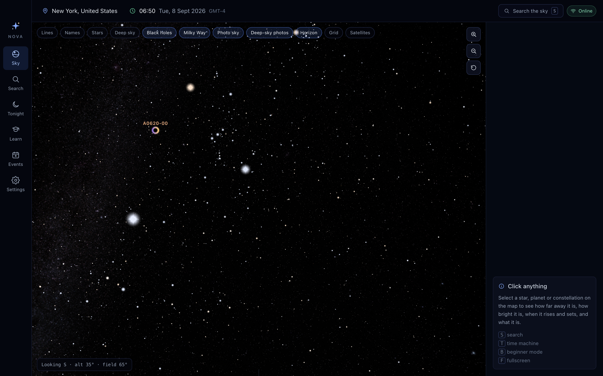

### Sky

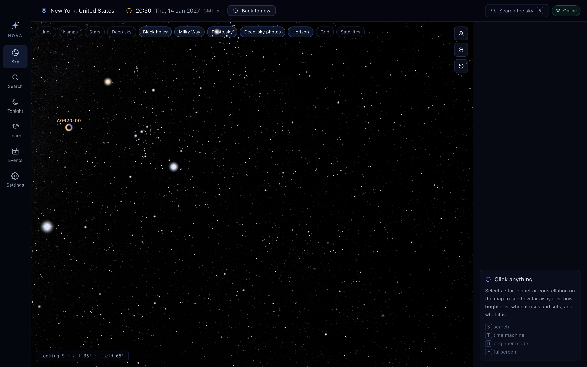

Layer chips at the top left, view controls at the top right, a camera readout at the
bottom left that lifts out of the way when the Time Machine is open. Clicking anything
opens the details panel.

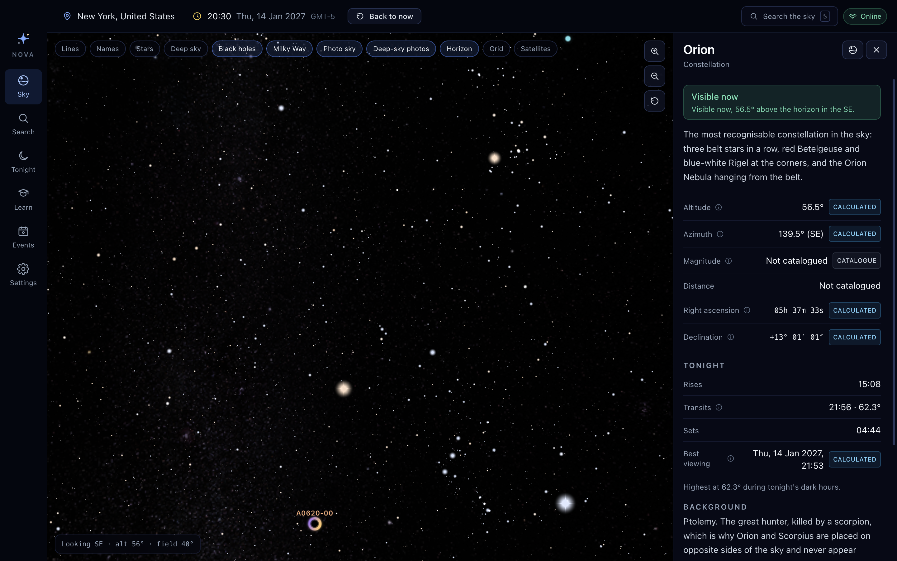

The horizon, ground and compass points stay fixed in the observer's frame while the sky
turns above them. The ground is very slightly transparent, so objects about to rise are
faintly visible below the line.

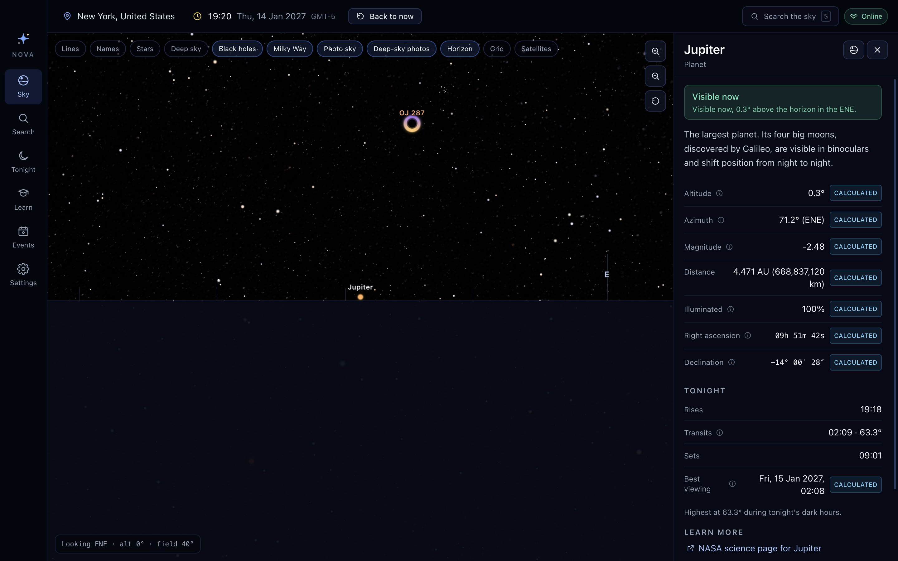

### Time Machine

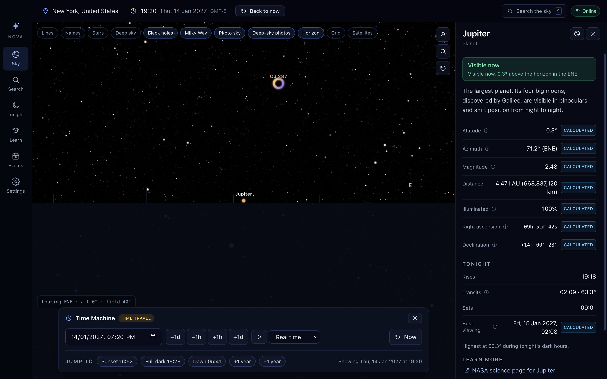

A datetime field, coarse and fine jumps, playback at up to a month per second, and jump
targets computed from tonight's own twilight times.

### Visible Tonight

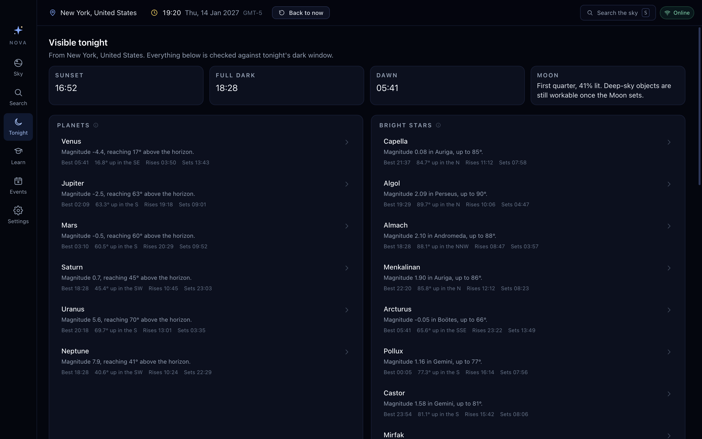

Four summary tiles for the night, then planets, bright stars, constellations, deep-sky
targets, ISS passes and upcoming events. Every row states the best time, the altitude
and direction at that time, and rise/set times.

### Events

Filterable by type and range. Each event says plainly whether it is visible from the
user's location, and offers to set the sky to that moment.

### Learn

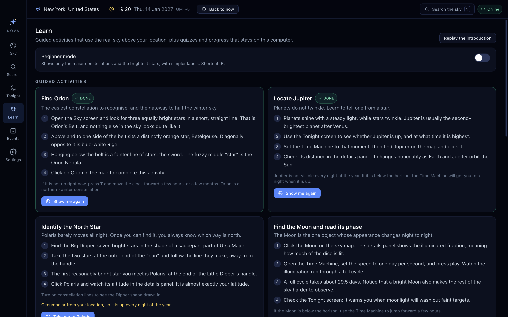

Guided activities complete when the learner actually selects the target object anywhere
in the app, so progress reflects use rather than a "mark as done" button. Activities
adapt to the hemisphere: Polaris is replaced by the Southern Cross below the equator.

### Search

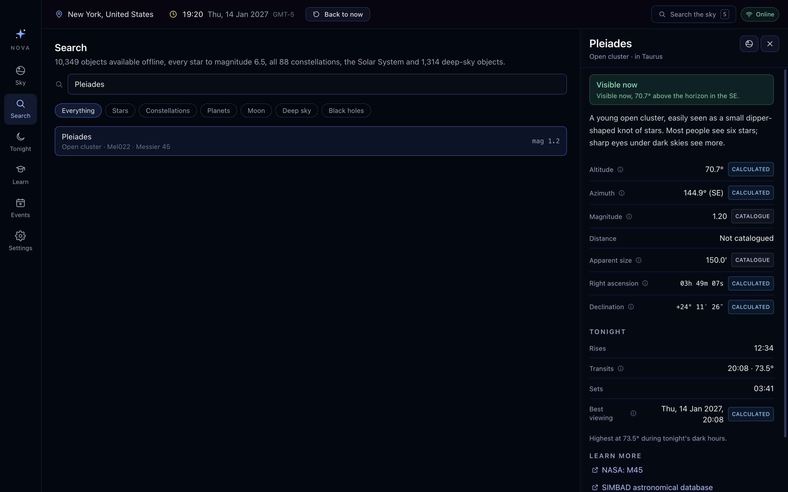

A full screen with filters, plus a command-palette overlay on `S` from anywhere.

### Settings

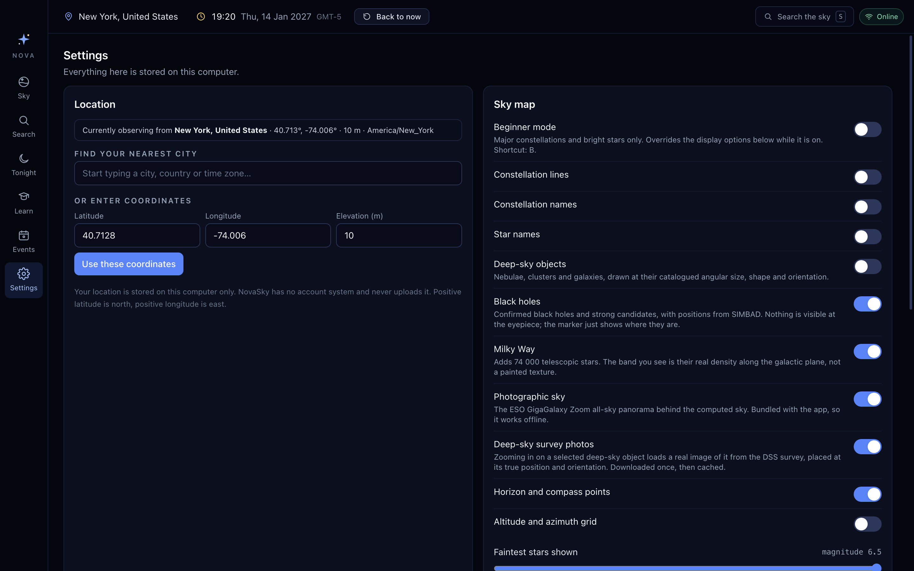

Location, display, notifications, data and privacy, and the shortcut reference. The
data section reports exactly what is stored locally and how old it is.

## The sky map's visual language

Everything on the map is drawn from real catalogue values. The only exaggerations are a
minimum drawn size for the Moon and for clickable markers.

**Stars** are coloured from their catalogued B−V index, sized by magnitude, and
twinkle — with an amplitude that rises toward the horizon, because scintillation is an
atmospheric effect and that is where the atmosphere is thickest. The brightest stars get
diffraction spikes and a soft bloom, which is how the eye reads "bright".

**Nebulae, clusters and galaxies** are drawn at their catalogued major axis, minor axis
and position angle, so shapes and orientations are real. Colours follow long-exposure
appearance: hydrogen-emission nebulae red-pink, reflection nebulae blue, planetary
nebulae green-teal, globular clusters warm yellow, open clusters blue-white. Fainter
objects glow more weakly. Locator rings fade out as you magnify, once the object's own
shape identifies it.

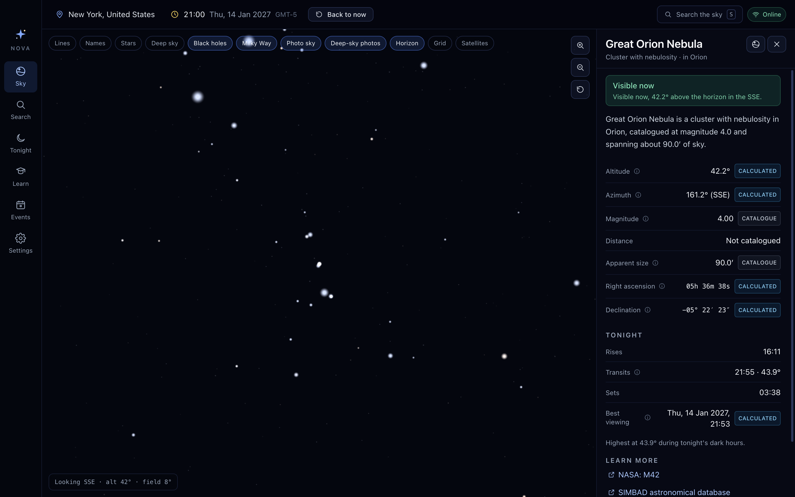

**The Milky Way** is not a painted texture. It is 74 559 real stars between magnitude
6.5 and 9.0 from the HYG catalogue; the band is their genuine density along the galactic
plane. It fades out at high magnification, where individual faint stars would read as
speckle rather than glow.

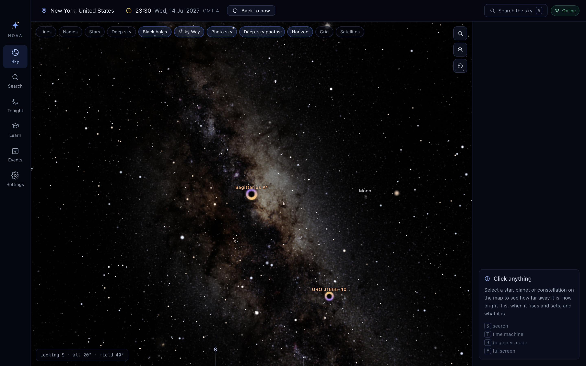

**The Moon** is drawn with its true phase. The terminator is the projected ellipse it
actually is, the bright limb points at the computed position of the Sun, and the unlit
portion carries a hint of earthshine.

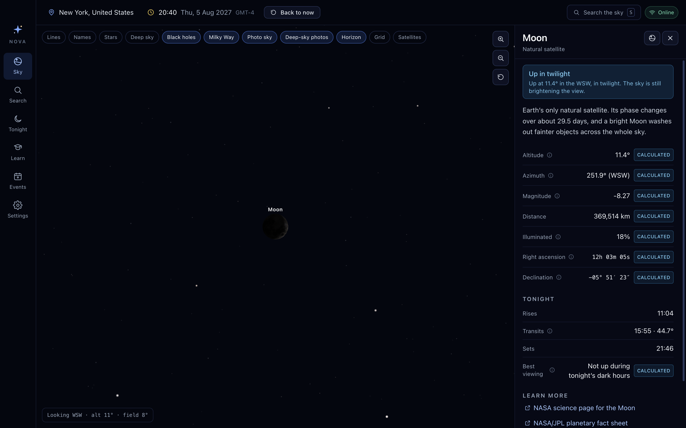

**Photography** is layered underneath everything computed. The all-sky panorama supplies
the dust and nebulosity of the Milky Way that no catalogue contains, held well below the
computed sky so labels stay legible, and faded out once the field narrows past the
panorama's own resolution.

Zooming in on a deep-sky object replaces the computed glow with a real survey image of
it, positioned and oriented from the projection the survey delivers. The proof that the
registration is right is visible in the picture: the catalogue star points sit exactly on
the stars in the photograph.

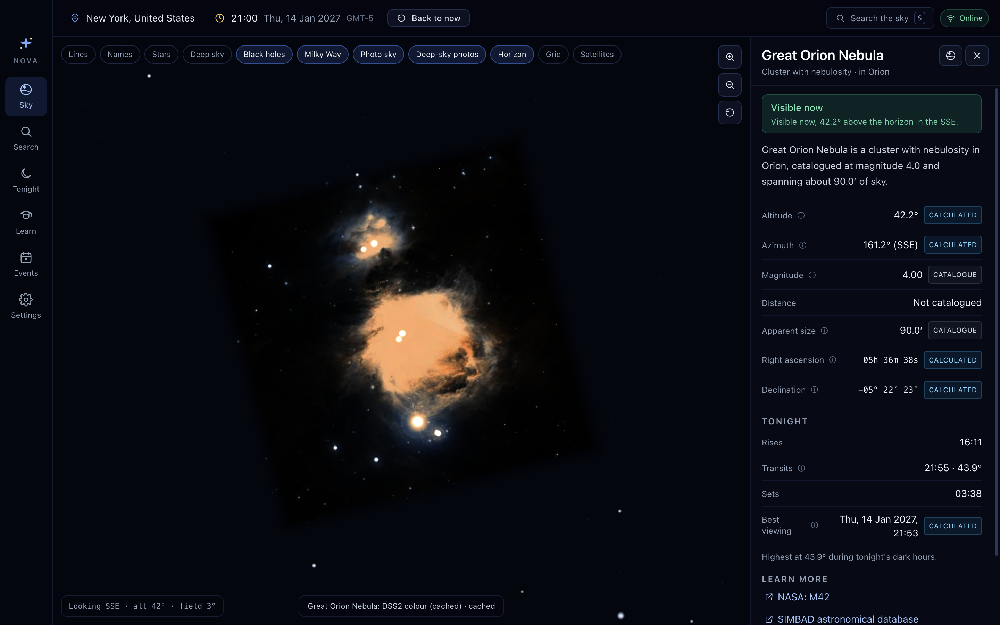

**Black holes** get a deliberately symbolic mark — a dark shadow inside a slowly turning,
Doppler-brightened accretion ring. Nothing about a black hole is visible at these
scales, and the details panel says so; the marker exists to show *where* they are.

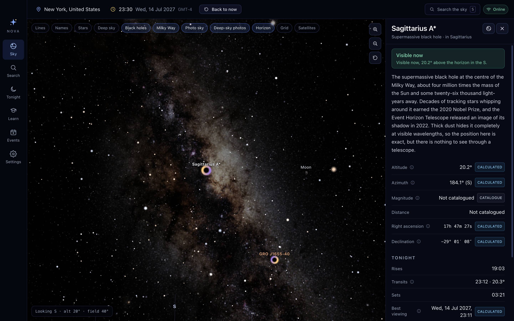

## Motion

Transitions are 150–250 ms on a `cubic-bezier(0.22, 1, 0.36, 1)` curve. Camera moves to
a selected object ease over 700 ms and take the shorter way around the compass.

Every animation in the sky map — twinkle, nebula breathing, accretion-ring rotation — is
multiplied by an `animate` uniform that is set to zero when the operating system reports
`prefers-reduced-motion: reduce`. The CSS honours the same preference.

## Accessibility

- Full keyboard navigation, including the sky map itself (arrows to look around, `+`/`-`
  to zoom, `0` to reset).
- A visible focus ring in `nova-400` on every interactive element.
- Toggles are real `role="switch"` controls with `aria-checked`; the search palette is a
  proper listbox with `aria-selected`; the onboarding is a labelled modal dialog.
- Tooltips are linked to their triggers with `aria-describedby`, so the explanation
  reaches screen readers rather than only hover.
- Loading and error states are announced with `role="status"` and `role="alert"`.
- Colour is never the only signal.
